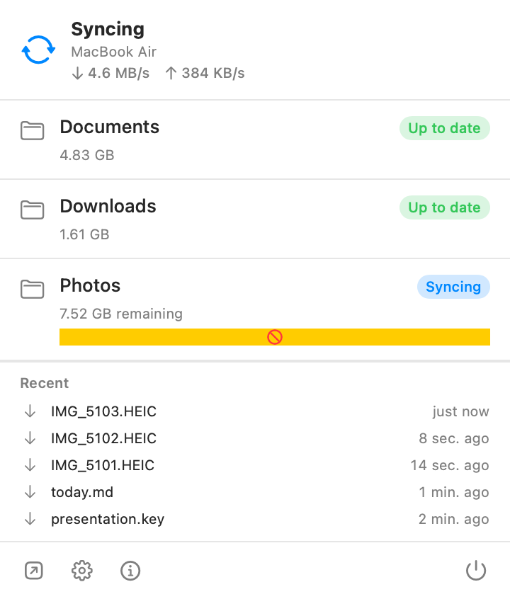

# Porthole

A native macOS menu bar app for [Syncthing](https://syncthing.net). Glance at the menu bar to see folder state at a glance, click for live throughput and recent transfers, get notified on real state changes — not the constant chatter of every transfer.

<p align="center">
  
</p>
<p align="center"><sub><i>Menu bar icon. Idle, syncing, error, daemon-unreachable — at a glance.</i></sub></p>

<p align="center">
  
</p>
<p align="center"><sub><i>Click for the popover: per-folder state with progress bars, live ↓/↑ throughput, recent transfers.</i></sub></p>

<p align="center">
  
</p>
<p align="center"><sub><i>System notifications on real transitions — folder reached up-to-date, folder errored, new device wants to connect — not on every transfer.</i></sub></p>

## Install

```sh
brew tap innerlightlabs-org/porthole https://github.com/innerlightlabs-org/porthole
brew install --cask porthole
```

For pre-release builds:

```sh
brew install --cask porthole@beta
```

The cask drops `Porthole.app` into `/Applications`. Future updates land via `brew upgrade --cask porthole`.

Prefer to install by hand? Download `Porthole-x.y.z.zip` from [Releases](https://github.com/innerlightlabs-org/porthole/releases), unzip, and drag `Porthole.app` into `/Applications`. Signed with Developer ID and notarized by Apple — no right-click-Open required.

### Requirements

- **macOS 26 (Tahoe)** or later
- **Syncthing** running locally:

  ```sh
  brew install syncthing
  brew services start syncthing
  ```

## Get your Syncthing API key

Porthole talks to Syncthing over its REST API and authenticates with an **API key**, which Syncthing auto-generates on first run. In the common case Porthole finds it for you — no setup needed.

Auto-discovery reads `~/Library/Application Support/Syncthing/config.xml` and pulls `<gui><address>` and `<gui><apikey>`. If Syncthing is on the same Mac with the default config, you're done.

You only need to set the key by hand if:

- Syncthing runs on a **different host** (e.g., a NAS or a headless server), or
- the config file is in a non-default location.

In that case, find the key one of two ways:

**Web UI** (http://127.0.0.1:8384) — click the gear → **Settings → GUI**. The **API Key** field is right there. Click **Generate** if you want a fresh one. Save.

**Edit `config.xml` directly** (Syncthing must be stopped first):

```sh
brew services stop syncthing
# open ~/Library/Application Support/Syncthing/config.xml
# look for <gui><apikey>...</apikey></gui> — copy the value
brew services start syncthing
```

In Porthole: **Preferences → Daemon** → paste the URL and key. Changes take effect on next launch.

## Privacy

Porthole is **connect-only and local-first**.

- Communication is entirely between Porthole and your Syncthing daemon over `127.0.0.1` (or whatever address you've pointed it at). Nothing leaves your machine on Porthole's account.
- **No telemetry, no analytics, no crash reporting** to any third party. Crashes, if they happen, surface in macOS's standard `~/Library/Logs/DiagnosticReports/` — they don't get phoned home.
- The Syncthing API key is read from your local config file and used only as the `X-API-Key` header on requests to your own daemon. It's never transmitted, logged, or stored anywhere outside Porthole's normal preferences.
- The app does **not** read or use the Syncthing GUI username / password — only the API key.

## Issues

[File an issue →](https://github.com/innerlightlabs-org/porthole/issues) using the **Bug report** or **Feature request** form. The form will ask for the version (Porthole's About panel) and how you installed — those two pieces of info save a round-trip.

## License

Porthole is © 2026 [Innerlight Labs](https://innerlightlabs.com). All rights reserved.

The compiled binaries distributed via this repository are made available free of charge for personal use. Redistribution, decompilation, modification, or reverse-engineering is not permitted without written permission from Innerlight Labs. Source code is not publicly available.

For licensing inquiries — including commercial use, OEM bundling, or source-code access — contact [hello@innerlightlabs.com](mailto:hello@innerlightlabs.com).

---

<sub>*Source repository for engineering work is private. This repo serves binaries, issues, and discussion.*</sub>
